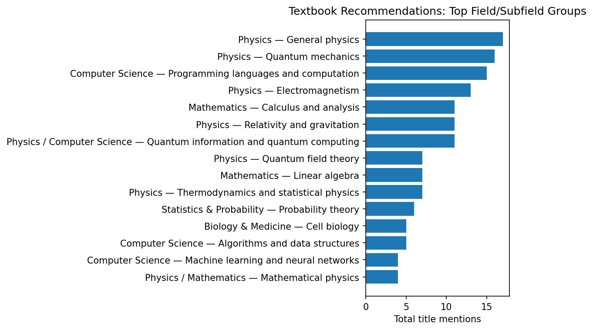

# Textbook Recommendation Counts

## Source

- Source document: <https://github.com/JaumeAmoresDS/home/blob/main/posts/others/textbook-recommendations.md>
- Generated from a best-effort normalized extraction of book-title mentions in the Markdown source.
- Obvious aliases were consolidated, for example `SICP` → `Structure and Interpretation of Computer Programs`, `QCQI` → `Quantum Computation and Quantum Information`, and `MTW/MWT` → `Gravitation`.
- Link-preview duplicates that repeated a title in the source text were counted as textual occurrences.
- Broad or vague references such as “this book” were omitted unless the referenced title or alias was clear.

## Prompt Used for the Counting Task

```text
Count the occurrences of each book title in the document below and provide the final aggregate counts:

https://github.com/JaumeAmoresDS/home/blob/main/posts/others/textbook-recommendations.md
```

## Current Prompt

```text
write a markdown document, in english, where you include the prompt i gave you (without the splitting or subagent instructions since it seems it wasn't really necessary), and with the result as a table. Include a small graph in png of counts grouped by fields (physics, CS, etc., and subfields (quantum mechanics, etc.). include the current prompt as well
```

## Summary Graph



The graph groups normalized title counts by broad field and subfield. Interdisciplinary titles are assigned to the most natural combined field label.

## Field/Subfield Aggregate Counts

| Field | Subfield | Total mentions |
| --- | --- | --- |
| Physics | General physics | 17 |
| Physics | Quantum mechanics | 16 |
| Computer Science | Programming languages and computation | 15 |
| Physics | Electromagnetism | 13 |
| Mathematics | Calculus and analysis | 11 |
| Physics | Relativity and gravitation | 11 |
| Physics / Computer Science | Quantum information and quantum computing | 11 |
| Mathematics | Linear algebra | 7 |
| Physics | Quantum field theory | 7 |
| Physics | Thermodynamics and statistical physics | 7 |
| Statistics & Probability | Probability theory | 6 |
| Biology & Medicine | Cell biology | 5 |
| Computer Science | Algorithms and data structures | 5 |
| Computer Science | Machine learning and neural networks | 4 |
| Mathematics | Algebra | 4 |
| Mathematics | Complex analysis | 4 |
| Mathematics | Differential geometry | 4 |
| Physics / Mathematics | Mathematical physics | 4 |
| Computer Science / Statistics | Information theory and machine learning | 3 |
| Mathematics | Differential equations | 3 |
| Mathematics | General mathematics | 3 |
| Mathematics / Physics | Dynamical systems | 3 |
| Arts & Design | Music theory | 2 |
| Biology & Medicine | Immunology | 2 |
| Biology & Medicine | Protein structure | 2 |
| Chemistry | General chemistry | 2 |
| Chemistry | Organic chemistry | 2 |
| Computer Science | Compilers and programming languages | 2 |
| Computer Science | Security and cryptography | 2 |
| Computer Science | Theory of computation | 2 |
| Engineering & Operations | Manufacturing and operations | 2 |
| Humanities & Social Science | Nature writing and culture | 2 |
| Mathematics | Number theory | 2 |
| Mathematics | Topology | 2 |
| Mathematics / Computer Science | Discrete mathematics | 2 |
| Mathematics / Philosophy | Logic | 2 |
| Physics | Classical mechanics | 2 |
| Physics | Condensed matter physics | 2 |
| Physics | Field theory and relativity | 2 |
| Physics | Many-body physics | 2 |
| Physics | Physics anthology/history | 2 |
| Physics | Quantum foundations | 2 |
| Physics | Statistical physics | 2 |
| Physics | Theoretical physics | 2 |
| Physics / Astronomy | Astronomy and astrophysics | 2 |
| Physics / Mathematics | Classical mechanics | 2 |
| Statistics & Probability | Bayesian statistics | 2 |
| Arts & Design | Architecture and design | 1 |
| Arts & Design | Art history | 1 |
| Arts & Design | Drawing | 1 |
| Arts & Design | Game design | 1 |
| Biology & Medicine | Biochemistry | 1 |
| Biology & Medicine | Biophysics | 1 |
| Biology & Medicine | Developmental biology | 1 |
| Biology & Medicine | Epidemiology | 1 |
| Biology & Medicine | Evolutionary biology | 1 |
| Biology & Medicine | General biology | 1 |
| Biology & Medicine | Nutrition and neuroscience | 1 |
| Biology & Medicine | Plant physiology | 1 |
| Biology & Medicine | Protein physics | 1 |
| Business & Management | Management | 1 |
| Chemistry | Electrochemistry | 1 |
| Chemistry / Mathematics | Molecular science | 1 |
| Chemistry / Physics | Quantum chemistry | 1 |
| Computer Science | Artificial intelligence | 1 |
| Computer Science | Computer systems | 1 |
| Computer Science | Distributed systems and databases | 1 |
| Computer Science | Evolutionary computation | 1 |
| Computer Science | Linear algebra and computing | 1 |
| Computer Science | Low-level programming | 1 |
| Computer Science | Networks and systems | 1 |
| Computer Science | Operating systems | 1 |
| Computer Science | Reinforcement learning | 1 |
| Computer Science / Graphics | Computer graphics | 1 |
| Computer Science / Network Science | Networks | 1 |
| Earth & Environmental Science | Geology and tectonics | 1 |
| Earth & Environmental Science | Meteorology and nature writing | 1 |
| Economics | Economic theory | 1 |
| Economics | International economics | 1 |
| Economics | Microeconomics | 1 |
| Economics / Mathematics | Game theory | 1 |
| Engineering & Operations | Dynamical systems | 1 |
| Engineering & Operations | Electronics | 1 |
| Engineering & Operations | Rocketry | 1 |
| Engineering & Operations | Signals and systems | 1 |
| Engineering & Operations | Simulation | 1 |
| Engineering & Operations | Technology and mechanics | 1 |
| Humanities & Social Science | History and civilization | 1 |
| Humanities & Social Science | Memoir | 1 |
| Literature | Fiction | 1 |
| Literature | Fiction / intellectual history | 1 |
| Mathematics | Algebra and representation theory | 1 |
| Mathematics | Algebraic geometry | 1 |
| Mathematics | Analysis and transforms | 1 |
| Mathematics | Category theory | 1 |
| Mathematics | Combinatorics | 1 |
| Mathematics | Geometry and measure theory | 1 |
| Mathematics | Geometry and trigonometry | 1 |
| Mathematics | Lie theory | 1 |
| Mathematics | Number theory and algebraic geometry | 1 |
| Mathematics | Partial differential equations | 1 |
| Mathematics | Set theory and logic | 1 |
| Mathematics / Computer Science | Algebra and CS | 1 |
| Mathematics / Computer Science | Cryptography | 1 |
| Mathematics / Engineering | Optimization | 1 |
| Mathematics / Philosophy | Logic and foundations | 1 |
| Mathematics / Physics | Mathematical methods | 1 |
| Mathematics / Physics | Vector calculus | 1 |
| Philosophy | Ethics | 1 |
| Philosophy / Religion | Religion and apologetics | 1 |
| Physics | Acoustics | 1 |
| Physics | Atomic physics | 1 |
| Physics | Condensed matter / matter structure | 1 |
| Physics | Mathematical physics and cosmology | 1 |
| Physics | Modern physics | 1 |
| Physics | Optics | 1 |
| Physics | Quantum physics | 1 |
| Physics | Relativity and quantum theory | 1 |
| Physics / Astronomy | Astronomy history | 1 |
| Physics / Astronomy | Cosmology | 1 |
| Physics / Biology | Biophysics and vision | 1 |
| Physics / Mathematics | Gauge theory and geometry | 1 |
| Physics / Mathematics | Particle physics and algebra | 1 |
| Political Science | Democracy and politics | 1 |
| Psychology / Decision Science | Decision science | 1 |
| Statistics & Probability | Causality | 1 |
| Statistics & Probability | Monte Carlo methods | 1 |
| Statistics & Probability | Reliability statistics | 1 |
| Statistics & Probability | Statistical inference | 1 |
| Statistics & Probability | Statistical learning | 1 |
| Statistics & Probability / Mathematics | Stochastic calculus | 1 |
| Writing & Language | Semantics | 1 |
| Writing & Language | Writing | 1 |

## Full Normalized Title Counts

| Title | Count | Field | Subfield | Notes / aliases |
| --- | --- | --- | --- | --- |
| Quantum Computation and Quantum Information | 11 | Physics / Computer Science | Quantum information and quantum computing | Includes QCQI and 'Quantum Computing by Mike and Ike'. |
| The Feynman Lectures on Physics | 11 | Physics | General physics | Includes variants such as Feynman lectures / Feynman’s lectures in physics. |
| Structure and Interpretation of Computer Programs | 9 | Computer Science | Programming languages and computation | Includes SICP and wizard-book references. |
| Electricity and Magnetism — Purcell | 6 | Physics | Electromagnetism | Includes Purcell E&M and Berkeley-series references. |
| Introduction to Electrodynamics — Griffiths | 5 | Physics | Electromagnetism | Includes 'David Griffiths on electromagnetism' and Griffiths electrodynamics variants. |
| Probability Theory: The Logic of Science — Jaynes | 4 | Statistics & Probability | Probability theory | Includes Jaynes Probability Theory variants. |
| The Molecular Biology of the Cell | 4 | Biology & Medicine | Cell biology | Includes MBOC and Alberts references. |
| The Principles of Quantum Mechanics — Dirac | 4 | Physics | Quantum mechanics | Includes POQM and Dirac variants. |
| An Introduction to Thermal Physics — Schroeder | 3 | Physics | Thermodynamics and statistical physics | Includes Schroeder on thermal physics. |
| Calculus — Spivak | 3 | Mathematics | Calculus and analysis | Includes Spivak's Calculus. |
| Fundamentals of Physics / Physics — Halliday, Resnick, Walker | 3 | Physics | General physics | Includes Halliday & Resnick and Fundamentals of Physics variants. |
| Gravitation — Misner, Thorne, Wheeler / MTW | 3 | Physics | Relativity and gravitation | Includes MTW/MWT variants. |
| Information Theory, Inference, and Learning Algorithms | 3 | Computer Science / Statistics | Information theory and machine learning | David J. C. MacKay. |
| Introduction to Quantum Mechanics — Griffiths | 3 | Physics | Quantum mechanics | Griffiths QM variants. |
| Linear Algebra Done Right | 3 | Mathematics | Linear algebra | Sheldon Axler. |
| Nonlinear Dynamics and Chaos | 3 | Mathematics / Physics | Dynamical systems | Steven Strogatz. |
| Spacetime Physics | 3 | Physics | Relativity and gravitation | Taylor and Wheeler. |
| The Little Schemer | 3 | Computer Science | Programming languages and computation | Includes lower-case variants. |
| Thermal Physics — Kittel and Kroemer | 3 | Physics | Thermodynamics and statistical physics | Kittel/Kroemer. |
| Understanding Analysis | 3 | Mathematics | Calculus and analysis | Includes repeated link-preview title occurrences. |
| Classical Theory of Fields — Landau & Lifshitz | 2 | Physics | Field theory and relativity |  |
| Compilers / Dragon Book | 2 | Computer Science | Compilers and programming languages | Aho, Lam, Sethi, Ullman. |
| Complex Variables and Applications | 2 | Mathematics | Complex analysis | Brown and Churchill. |
| Essentials of Discrete Mathematics | 2 | Mathematics / Computer Science | Discrete mathematics | David Hunter; includes link-preview duplicate. |
| Factory Physics | 2 | Engineering & Operations | Manufacturing and operations |  |
| Introduction to Proteins: Structure, Function, and Motion | 2 | Biology & Medicine | Protein structure | Includes link-preview duplicate. |
| Linear Algebra — Gilbert Strang | 2 | Mathematics | Linear algebra |  |
| Mathematical Methods of Classical Mechanics — Arnold | 2 | Physics / Mathematics | Classical mechanics |  |
| Mathematical Omnibus | 2 | Mathematics | General mathematics | Includes link-preview duplicate. |
| Modern Quantum Mechanics — Sakurai | 2 | Physics | Quantum mechanics | Includes Sakurai variants. |
| Neural Networks and Deep Learning | 2 | Computer Science | Machine learning and neural networks |  |
| On Trails | 2 | Humanities & Social Science | Nature writing and culture | Includes referenced post and title. |
| Ordinary Differential Equations — Arnold | 2 | Mathematics | Differential equations |  |
| PCT, Spin and Statistics, and All That | 2 | Physics | Quantum field theory | Includes link-preview title duplicate. |
| Quantum Mechanics — Cohen-Tannoudji | 2 | Physics | Quantum mechanics |  |
| Quantum Theory: Concepts and Methods — Peres | 2 | Physics | Quantum foundations | Asher Peres. |
| Statistical Rethinking | 2 | Statistics & Probability | Bayesian statistics | Richard McElreath. |
| The Physical Universe: An Introduction to Astronomy | 2 | Physics / Astronomy | Astronomy and astrophysics | Includes link-preview title duplicate. |
| The Quantum Theory of Fields — Weinberg | 2 | Physics | Quantum field theory |  |
| The World of Physics | 2 | Physics | Physics anthology/history | Includes shortened link-preview duplicate. |
| Visual Complex Analysis | 2 | Mathematics | Complex analysis | Needham. |
| Visual Differential Geometry / Visual Differential Geometry and Forms | 2 | Mathematics | Differential geometry | Needham. |
| A First Course in General Relativity | 1 | Physics | Relativity and gravitation | Bernard Schutz. |
| A Unified Grand Tour of Theoretical Physics | 1 | Physics | Theoretical physics | Lawrie. |
| ANSI Common Lisp | 1 | Computer Science | Programming languages and computation | Paul Graham. |
| Abbas Immunology | 1 | Biology & Medicine | Immunology |  |
| Advanced Quantum Mechanics | 1 | Physics | Quantum mechanics | J. J. Sakurai. |
| Algebra for Computer Science | 1 | Mathematics / Computer Science | Algebra and CS | Garding and Tambour. |
| Algebra — Godemont | 1 | Mathematics | Algebra |  |
| Algebraic Topology — Hatcher | 1 | Mathematics | Topology |  |
| Algorithms — Dasgupta, Papadimitriou, Vazirani | 1 | Computer Science | Algorithms and data structures |  |
| Algorithms — Jeff Erickson | 1 | Computer Science | Algorithms and data structures |  |
| An Introduction to Statistical Inference | 1 | Statistics & Probability | Statistical inference | Michael Trosset. |
| An Introduction to Statistical Learning | 1 | Statistics & Probability | Statistical learning |  |
| Artificial Intelligence: A Modern Approach | 1 | Computer Science | Artificial intelligence | AIMA. |
| Atomic Physics | 1 | Physics | Atomic physics | Christopher J. Foot. |
| Barbarian Days | 1 | Humanities & Social Science | Memoir |  |
| Basic Algebra II | 1 | Mathematics | Algebra | Jacobson. |
| Calculus books by Mir Publishers | 1 | Mathematics | Calculus and analysis | Piskunov, Maron. |
| Calculus with Analytic Geometry — Swokowski | 1 | Mathematics | Calculus and analysis |  |
| Calculus with Analytical Geometry — Larson, Hostetler, Edwards | 1 | Mathematics | Calculus and analysis |  |
| Calculus — Apostol | 1 | Mathematics | Calculus and analysis |  |
| Callen’s Thermodynamics | 1 | Physics | Thermodynamics and statistical physics |  |
| Campbell’s Biology | 1 | Biology & Medicine | General biology |  |
| Categories in Context | 1 | Mathematics | Category theory |  |
| Causality | 1 | Statistics & Probability | Causality | Judea Pearl. |
| Cell Biology by the Numbers | 1 | Biology & Medicine | Cell biology |  |
| Chemistry: The Central Science | 1 | Chemistry | General chemistry |  |
| Classical Electrodynamics — Jackson | 1 | Physics | Electromagnetism | JD Jackson. |
| Coding the Matrix | 1 | Computer Science | Linear algebra and computing |  |
| College Physics | 1 | Physics | General physics | AP French. |
| Contemporary Abstract Algebra | 1 | Mathematics | Algebra | Joseph Gallian. |
| Continuous System Simulation | 1 | Engineering & Operations | Simulation | Cellier and Kofman. |
| Conversations on Natural Philosophy | 1 | Physics | General physics |  |
| Convex Optimization | 1 | Mathematics / Engineering | Optimization | Boyd and Vandenberghe. |
| Cosmology: The Science of the Universe | 1 | Physics / Astronomy | Cosmology | Edward R. Harrison. |
| Cryptography Engineering | 1 | Computer Science | Security and cryptography | Ferguson, Schneier, Kohno. |
| Data Communications and Networking | 1 | Computer Science | Networks and systems | Forouzan. |
| Designing Data-Intensive Applications | 1 | Computer Science | Distributed systems and databases | Kleppmann. |
| Differential Equations with Applications and Historical Notes | 1 | Mathematics | Differential equations | George Simmons. |
| Differential Forms in Algebraic Topology | 1 | Mathematics | Topology | Bott and Tu. |
| Div, Grad, Curl, and All That | 1 | Mathematics / Physics | Vector calculus |  |
| Economic Theory | 1 | Economics | Economic theory | Becker. |
| Electrochemical Methods | 1 | Chemistry | Electrochemistry | Bard and Faulkner. |
| Elementary Calculus: An Infinitesimal Approach | 1 | Mathematics | Calculus and analysis |  |
| Elements of PDE | 1 | Mathematics | Partial differential equations | Sneddon. |
| Elliptic Curves | 1 | Mathematics | Number theory and algebraic geometry | Washington. |
| Enumerative Combinatorics | 1 | Mathematics | Combinatorics | Stanley. |
| Epidemiologic Methods | 1 | Biology & Medicine | Epidemiology | Koepsell and Weiss. |
| Essentials of Electromagnetism | 1 | Physics | Electromagnetism | David Dugdale. |
| Evolution of Civilizations | 1 | Humanities & Social Science | History and civilization |  |
| Evolutionary Design by Computers | 1 | Computer Science | Evolutionary computation |  |
| Feller’s Introduction to Probability Theory | 1 | Statistics & Probability | Probability theory |  |
| Fourier Transforms | 1 | Mathematics | Analysis and transforms | Sneddon. |
| From Photon to Neuron | 1 | Physics / Biology | Biophysics and vision | Philip Nelson. |
| Fun and Games: A Text on Game Theory | 1 | Economics / Mathematics | Game theory | Ken Binmore. |
| Fundamentals of Physics — Shankar | 1 | Physics | General physics |  |
| GR Workbook | 1 | Physics | Relativity and gravitation | Thomas Moore. |
| Galois Theory | 1 | Mathematics | Algebra | Emil Artin. |
| Gardner’s Art Through the Ages | 1 | Arts & Design | Art history |  |
| Gauge Fields, Knots and Gravity | 1 | Physics / Mathematics | Gauge theory and geometry | Baez and Muniain. |
| General Chemistry — Pauling | 1 | Chemistry | General chemistry |  |
| Geometric Measure Theory | 1 | Mathematics | Geometry and measure theory | Frank Morgan. |
| Geometrical Methods of Mathematical Physics | 1 | Physics / Mathematics | Mathematical physics | Bernard Schulz. |
| Gilbert’s Developmental Biology | 1 | Biology & Medicine | Developmental biology |  |
| Grain Brain | 1 | Biology & Medicine | Nutrition and neuroscience |  |
| Guide to Feynman Diagrams in the Many-Body Problem | 1 | Physics | Many-body physics | Richard Mattuck. |
| Gödel’s Proof | 1 | Mathematics / Philosophy | Logic | Nagel and Newman. |
| Hacker’s Delight | 1 | Computer Science | Low-level programming | Henry S. Warren Jr. |
| Harmonic Experience | 1 | Arts & Design | Music theory |  |
| Ideals, Varieties and Algorithms | 1 | Mathematics | Algebraic geometry | Cox, Little, O’Shea. |
| Ignition | 1 | Engineering & Operations | Rocketry | Clark. |
| Illustrating C | 1 | Computer Science | Programming languages and computation | Donald Alcock. |
| Introduction to Classical Mechanics | 1 | Physics | Classical mechanics | David Morin. |
| Introduction to Dynamic Systems | 1 | Engineering & Operations | Dynamical systems | David Luenberger. |
| Introduction to Lie Algebras and Representation Theory | 1 | Mathematics | Algebra and representation theory | Humphreys. |
| Introduction to Probability | 1 | Statistics & Probability | Probability theory | Stat110 / Jessica Hwang. |
| Introduction to Riemannian Manifolds | 1 | Mathematics | Differential geometry | John M. Lee. |
| Introduction to the Structure of Matter | 1 | Physics | Condensed matter / matter structure | Chalmers. |
| Introduction to the Theory of Computation | 1 | Computer Science | Theory of computation | Sipser. |
| Introduction to the Theory of Numbers | 1 | Mathematics | Number theory | Niven. |
| Janeway’s Immunology | 1 | Biology & Medicine | Immunology |  |
| Knots and Physics | 1 | Physics / Mathematics | Mathematical physics | Kauffman. |
| Language, Proof and Logic | 1 | Mathematics / Philosophy | Logic | Barwise and Etchemendy. |
| Lectures on Phase Transitions and the Renormalization Group | 1 | Physics | Statistical physics | Nigel Goldenfeld. |
| Lectures on Quantum Theory: Mathematical and Structural Foundations | 1 | Physics | Quantum mechanics | Isham. |
| Lehninger’s Principles of Biochemistry | 1 | Biology & Medicine | Biochemistry |  |
| Lie Algebras in Particle Physics | 1 | Physics / Mathematics | Particle physics and algebra | Howard Georgi. |
| Linear Algebra — Friedberg, Insel, Spence | 1 | Mathematics | Linear algebra |  |
| Linear Algebra — Lang | 1 | Mathematics | Linear algebra |  |
| Managerial Dilemmas | 1 | Business & Management | Management | Miller. |
| Many-Particle Physics | 1 | Physics | Many-body physics | Gerald Mahan. |
| Mas-Colell / Microeconomic Theory | 1 | Economics | Microeconomics |  |
| Mathematical Cryptography | 1 | Mathematics / Computer Science | Cryptography | Hoffstein and Silverman. |
| Mathematical Methods by Boas | 1 | Mathematics / Physics | Mathematical methods |  |
| Mathematical Methods for Molecular Science | 1 | Chemistry / Mathematics | Molecular science | John Straub. |
| Mathematical Physics — Geroch | 1 | Physics / Mathematics | Mathematical physics |  |
| Mathematical Physics — Sadri Hassani | 1 | Physics / Mathematics | Mathematical physics |  |
| Modern Physics | 1 | Physics | Modern physics | Arthur Beiser. |
| Monte Carlo Methods | 1 | Statistics & Probability | Monte Carlo methods | Mark Newman. |
| Naive Lie Theory | 1 | Mathematics | Lie theory | John Stillwell. |
| Networks — Newman | 1 | Computer Science / Network Science | Networks |  |
| Neural Networks for Pattern Recognition | 1 | Computer Science | Machine learning and neural networks | Christopher Bishop. |
| Newton’s Principia for the Common Reader | 1 | Physics | Classical mechanics | Chandrasekhar. |
| Normative Ethics | 1 | Philosophy | Ethics | Shelly Kagan. |
| Number Theory and Its History | 1 | Mathematics | Number theory | Ore. |
| On Writing Well | 1 | Writing & Language | Writing | William Zinsser. |
| Operating Systems — Tanenbaum | 1 | Computer Science | Operating systems |  |
| Optics — Hecht | 1 | Physics | Optics |  |
| Organic Chemistry — Morrison & Boyd | 1 | Chemistry | Organic chemistry |  |
| Organic Chemistry — Reutov, Kurz and Butin | 1 | Chemistry | Organic chemistry |  |
| Pattern Recognition and Machine Learning | 1 | Computer Science | Machine learning and neural networks | Christopher M. Bishop. |
| Pauli Theory of Relativity | 1 | Physics | Relativity and gravitation |  |
| Physically Based Rendering | 1 | Computer Science / Graphics | Computer graphics |  |
| Physics from Symmetry | 1 | Physics | Theoretical physics | Jakob Schwichtenberg. |
| Plant Physiology | 1 | Biology & Medicine | Plant physiology |  |
| Practical Electronics for Inventors | 1 | Engineering & Operations | Electronics |  |
| Principles of Quantum Mechanics — Shankar | 1 | Physics | Quantum mechanics |  |
| Problem Solving with Algorithms and Data Structures Using Python | 1 | Computer Science | Algorithms and data structures | Miller and Ranum. |
| Programming in Scala | 1 | Computer Science | Programming languages and computation |  |
| Protein Physics | 1 | Biology & Medicine | Protein physics | Finkelstein and Ptitsyn. |
| Quantum Chemistry | 1 | Chemistry / Physics | Quantum chemistry | Lowe. |
| Quantum Field Theory in a Nutshell | 1 | Physics | Quantum field theory | Zee. |
| Quantum Field Theory of Many-Body Systems | 1 | Physics | Quantum field theory | Xiao-Gang Wen. |
| Quantum Mechanics — Landau & Lifshitz | 1 | Physics | Quantum mechanics |  |
| Quantum Physics of Atoms, Molecules, Solids, Nuclei, and Particles | 1 | Physics | Quantum mechanics | Eisberg and Resnick. |
| Quantum Theory of Fields, Vol. I — Weinberg | 1 | Physics | Quantum field theory |  |
| Quantum Universe | 1 | Physics | Quantum physics |  |
| Rational Choice in an Uncertain World | 1 | Psychology / Decision Science | Decision science | Hastie and Dawes. |
| Rational Trigonometry | 1 | Mathematics | Geometry and trigonometry | N. J. Wildberg. |
| Reinforcement Learning: An Introduction | 1 | Computer Science | Reinforcement learning | Barto and Sutton. |
| Relativity and Quantum Theory | 1 | Physics | Relativity and quantum theory | Robert Resnick. |
| Reliability: Probabilistic Models and Statistical Methods | 1 | Statistics & Probability | Reliability statistics | Leemis. |
| Salt Tectonics | 1 | Earth & Environmental Science | Geology and tectonics | Jackson and Hudec. |
| Scaling and Renormalization in Statistical Physics | 1 | Physics | Statistical physics | John Cardy. |
| Sean Carroll’s general relativity book | 1 | Physics | Relativity and gravitation |  |
| Security Engineering | 1 | Computer Science | Security and cryptography | Anderson. |
| Semantics: Primes and Universals | 1 | Writing & Language | Semantics | Anna Wierzbicka. |
| Set Theory: An Introduction to Independence Proofs | 1 | Mathematics | Set theory and logic | Kenneth Kunen. |
| Shreve’s Stochastic Calculus | 1 | Statistics & Probability / Mathematics | Stochastic calculus |  |
| Signals and Systems | 1 | Engineering & Operations | Signals and systems | Oppenheim and Willsky. |
| Solid State Physics | 1 | Physics | Condensed matter physics | Kittel. |
| Special Relativity | 1 | Physics | Relativity and gravitation | French. |
| Spivak’s Introduction to Differential Geometry | 1 | Mathematics | Differential geometry |  |
| The Alchemist | 1 | Literature | Fiction |  |
| The Algorithm Design Manual | 1 | Computer Science | Algorithms and data structures | Steven Skiena. |
| The Art of Computer Programming, Vol. 4A/4B | 1 | Computer Science | Algorithms and data structures | Donald Knuth. |
| The Art of Game Design | 1 | Arts & Design | Game design | Jesse Schell. |
| The Cloudspotter’s Guide | 1 | Earth & Environmental Science | Meteorology and nature writing | Gavin Pretor-Piney. |
| The Dollar Trap | 1 | Economics | International economics | Eswar Prasad. |
| The Elements of Computing Systems | 1 | Computer Science | Computer systems | Nand2Tetris. |
| The Foundations of Arithmetic | 1 | Mathematics / Philosophy | Logic and foundations | Frege. |
| The Glass Bead Game | 1 | Literature | Fiction / intellectual history | Hesse. |
| The History and Practice of Ancient Astronomy | 1 | Physics / Astronomy | Astronomy history |  |
| The Irony of Democracy | 1 | Political Science | Democracy and politics |  |
| The Natural Way to Draw | 1 | Arts & Design | Drawing | Kimon Nicolaides. |
| The Nature of Computation | 1 | Computer Science | Theory of computation | Mertens and Moore. |
| The Nature of Order | 1 | Arts & Design | Architecture and design | Christopher Alexander. |
| The Reason for God | 1 | Philosophy / Religion | Religion and apologetics | Tim Keller. |
| The Road to Reality | 1 | Physics | Mathematical physics and cosmology | Roger Penrose. |
| The Science of Sound | 1 | Physics | Acoustics |  |
| The Selfish Gene | 1 | Biology & Medicine | Evolutionary biology | Richard Dawkins. |
| The Way Things Work | 1 | Engineering & Operations | Technology and mechanics | David Macaulay. |
| Theory of Harmony | 1 | Arts & Design | Music theory | Arnold Schoenberg. |
| Theory of Solids | 1 | Physics | Condensed matter physics | John Ziman. |
| What Is Life? | 1 | Biology & Medicine | Biophysics | Erwin Schrödinger. |
| What Is Mathematics? | 1 | Mathematics | General mathematics | Courant and Robbins. |
